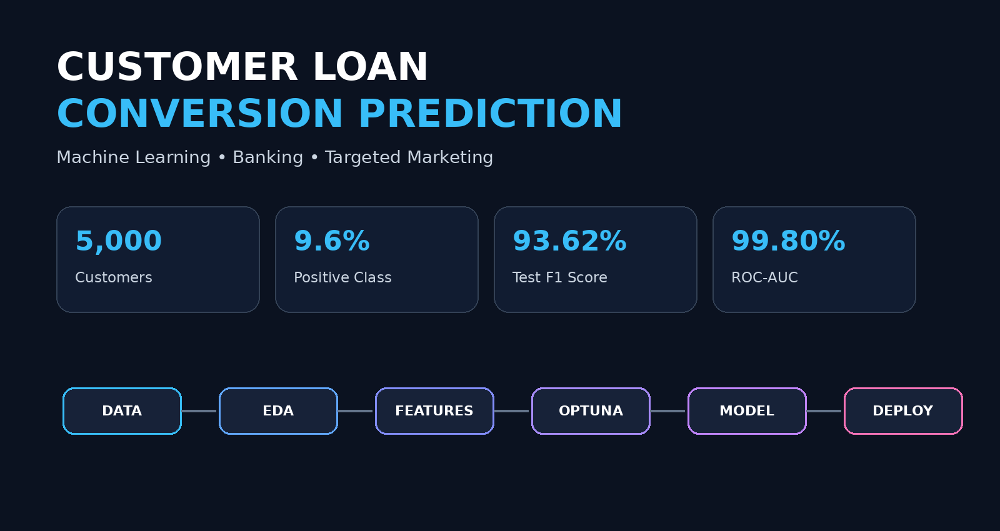

<div align="center">

# 🏦 Customer Loan Conversion Prediction

### 🎯 Predicting Which Bank Customers Are Most Likely to Accept a Personal Loan

<a href="https://customer-loan-conversion-prediction-cr9k.onrender.com/">

</a>

&nbsp;&nbsp;

<a href="https://github.com/Koushikmaity014/-Customer-Loan-Conversion-Prediction">

</a>

<br><br>



</div>

---
# 📌 Project Overview

**Customer Loan Conversion Prediction** is an end-to-end machine learning project developed to predict whether an existing bank customer is likely to accept a personal loan.

The project uses customer demographic, financial, and banking relationship information to identify customers who have a higher probability of accepting a personal loan. The main goal is to help the bank perform more **targeted and data-driven marketing** instead of contacting every customer.

The project follows a complete machine learning workflow, starting from **data exploration and preprocessing** and continuing through **model development, feature selection, cross-validation, hyperparameter optimization, threshold optimization, model evaluation, and deployment**.

### 🎯 Objective

> **To build a classification model that can identify customers with a high probability of accepting a personal loan and support more effective targeted marketing campaigns.**

### 🔄 Project Workflow

```text
📊 Dataset
   ↓
🔎 Exploratory Data Analysis
   ↓
🧹 Data Preprocessing
   ↓
🤖 Model Development
   ↓
🧠 Feature Selection
   ↓
🔄 Stratified Cross-Validation
   ↓
⚡ Optuna Hyperparameter Tuning
   ↓
🎚️ Threshold Optimization
   ↓
🏆 Model Evaluation
   ↓
💾 Model Serialization
   ↓
🖥️ Streamlit Application
   ↓
🚀 Render Deployment
