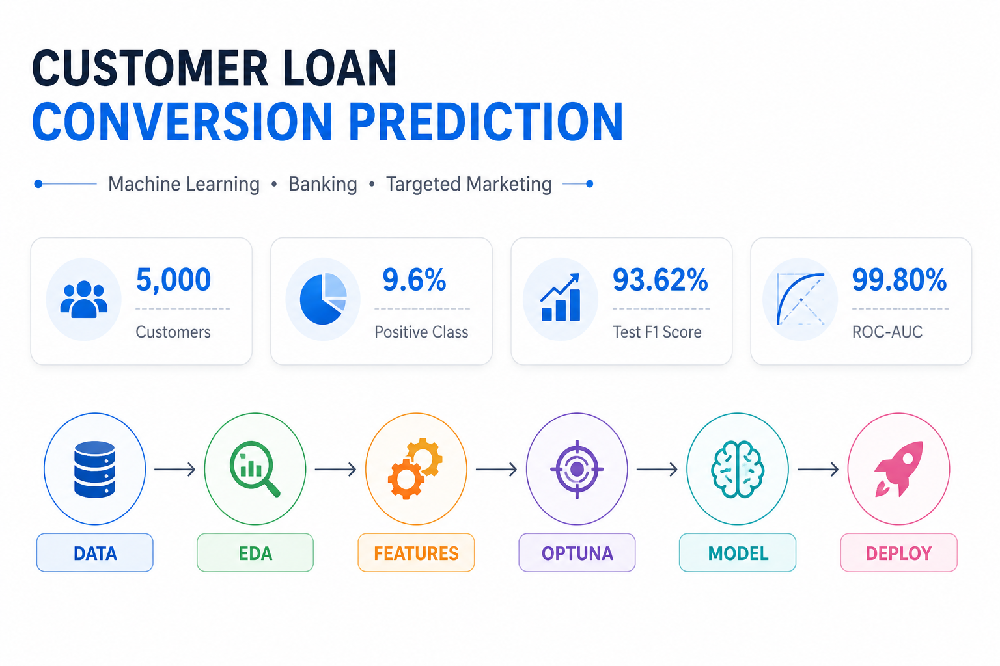
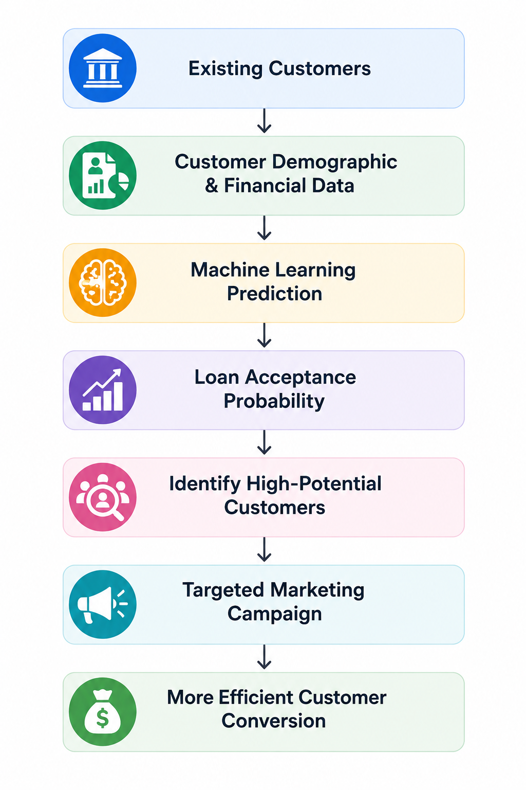
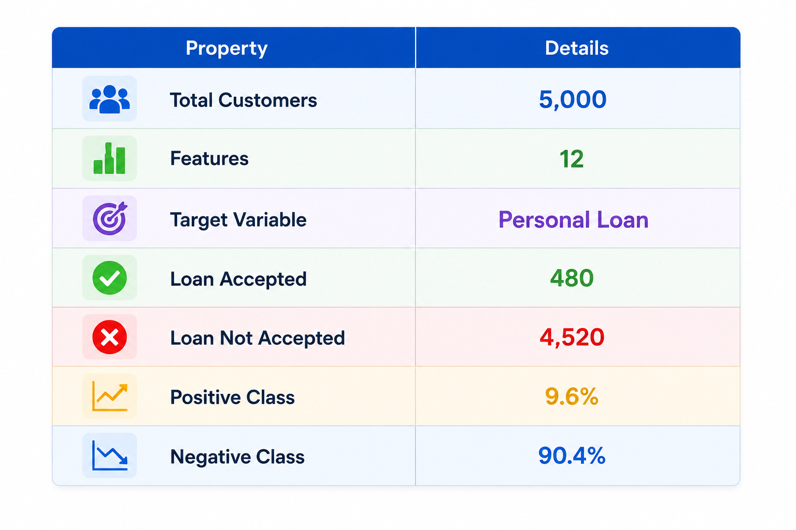
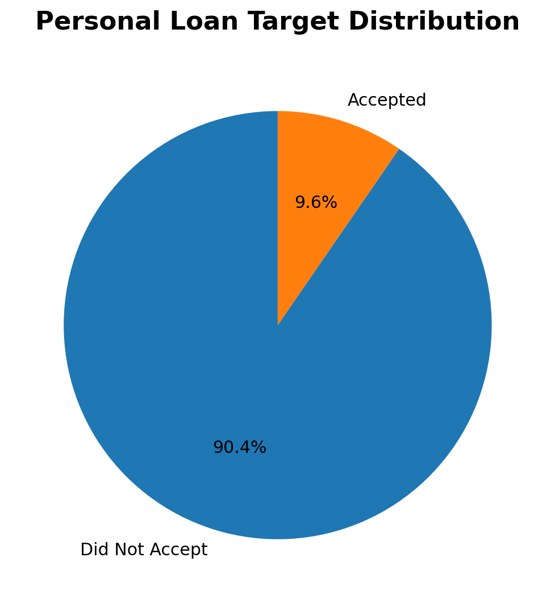

# 🏦 Customer Loan Conversion Prediction

### 🎯 Predicting Which Bank Customers Are Most Likely to Accept a Personal Loan

&nbsp;&nbsp;

  

---
# 📌 Project Overview

**Customer Loan Conversion Prediction** is an end-to-end machine learning project developed to predict whether an existing bank customer is likely to accept a personal loan.

The project uses customer demographic, financial, and banking relationship information to identify customers who have a higher probability of accepting a personal loan. The main goal is to help the bank perform more **targeted and data-driven marketing** instead of contacting every customer.

The project follows a complete machine learning workflow, starting from **data exploration and preprocessing** and continuing through **model development, feature selection, cross-validation, hyperparameter optimization, threshold optimization, model evaluation, and deployment**.

### 🎯 Objective

> **To build a classification model that can identify customers with a high probability of accepting a personal loan and support more effective targeted marketing campaigns.**

### 🔄 Project Workflow

  

---
# 💼 Business Problem

Banks have a large number of existing customers, but only a small proportion of them may be interested in purchasing a personal loan.

In this project, the bank wants to identify customers who are more likely to accept a personal loan so that marketing campaigns can focus on high-potential customers rather than contacting the entire customer base.

The previous campaign had a conversion rate of **9.6%**, with only **480 out of 5,000 customers** accepting the personal loan. This creates a challenging **imbalanced classification problem** where accurately identifying the positive customers is more important than simply maximizing overall accuracy.

## 🎯 Business Goal

The primary goal is to build a machine learning system that can:

- 🎯 Identify customers with a higher probability of accepting a personal loan.
- 📣 Support targeted marketing campaigns.
- 💰 Reduce unnecessary marketing efforts.
- 📈 Improve the efficiency of customer targeting.
- 🤝 Help the bank focus on customers with higher conversion potential.

### 🔄 From Mass Marketing to Targeted Marketing

  

---
# 📊 Dataset

The project uses the **Bank Personal Loan Modelling** dataset obtained from **Kaggle**. The dataset contains **5,000 bank customers** with demographic, financial, and banking relationship information.

  

### 🎯 Target Variable

The target variable is **`Personal Loan`**, which indicates whether a customer accepted the personal loan offered during the previous campaign.

**0 → Did not accept the personal loan**  
**1 → Accepted the personal loan**

### ⚠️ Class Distribution

Only **480 customers (9.6%)** accepted the loan, while **4,520 customers (90.4%)** did not. This makes the dataset a **highly imbalanced binary classification problem**.

  

Because of the class imbalance, model performance is evaluated using **Precision, Recall, F1 Score, ROC-AUC, and PR-AUC** rather than relying on accuracy alone.

---
