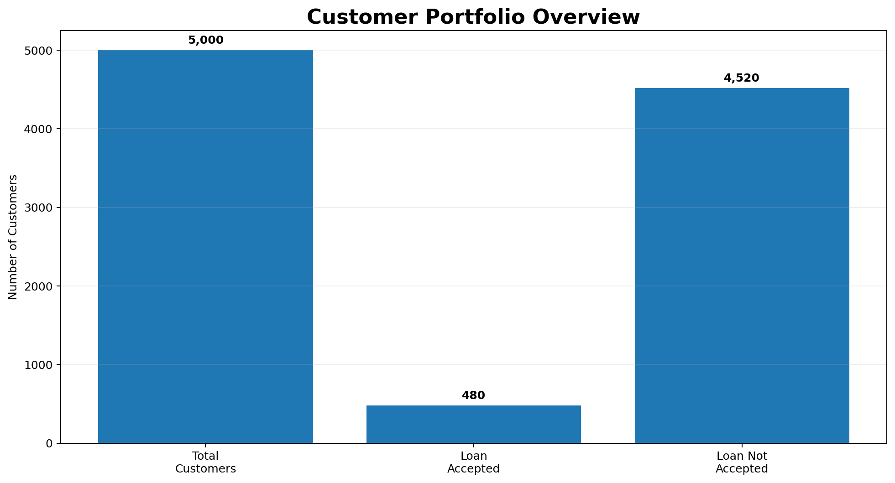
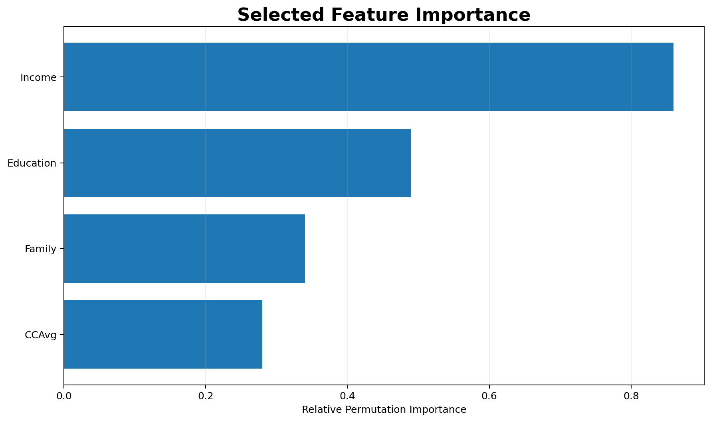
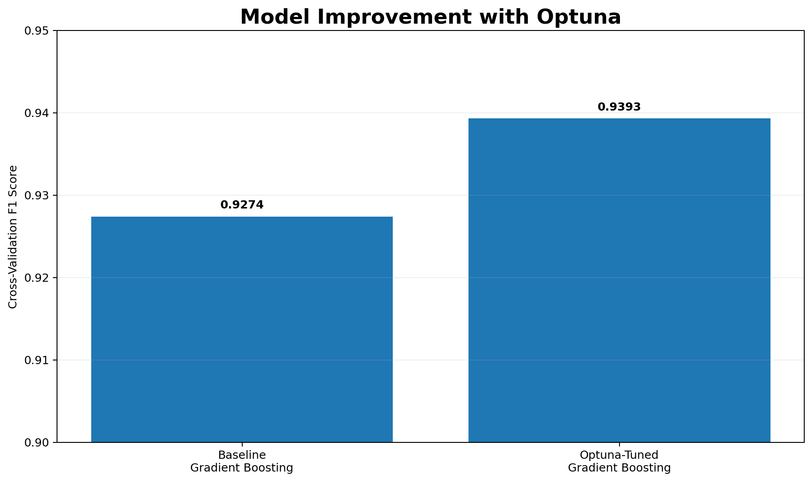
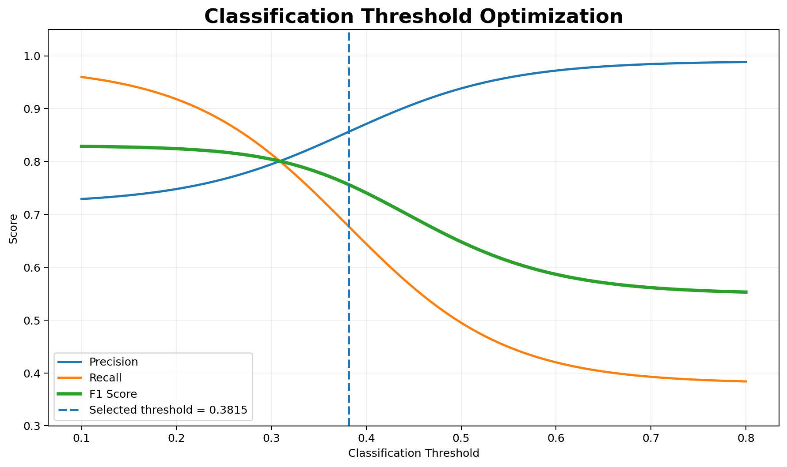
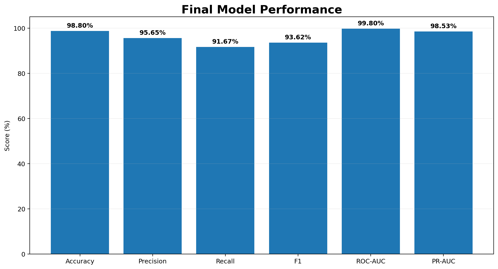
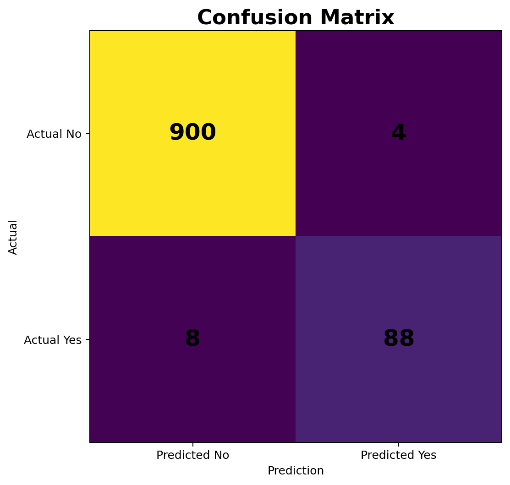
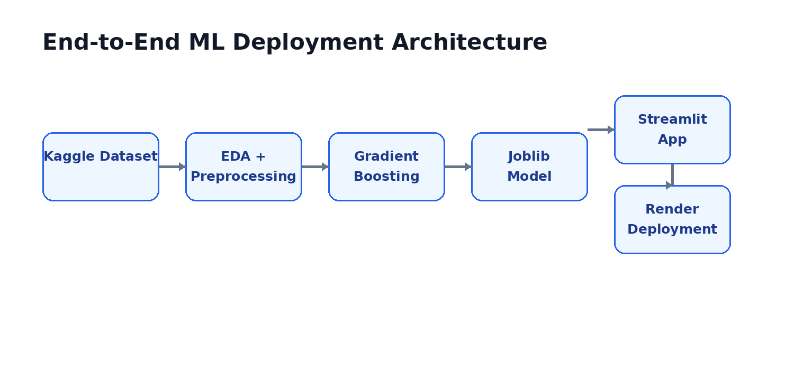

🏦 Customer Loan Conversion Prediction

🎯 Predicting Which Bank Customers Are Most Likely to Accept a Personal Loan

&nbsp;

  

  

🚀 Live Application

  

Live Demo:
https://customer-loan-conversion-prediction-cr9k.onrender.com/

📌 Project Overview

Customer Loan Conversion Prediction is an end-to-end machine learning project developed to predict whether an existing bank customer is likely to accept a personal loan.

The project uses customer demographic, financial, and banking relationship information to identify high-potential customers and support more targeted marketing campaigns.

Instead of contacting every customer, the model can help the bank prioritize customers who have a higher probability of accepting a personal loan.

Complete Workflow

Kaggle Dataset
      ↓
Data Understanding
      ↓
Exploratory Data Analysis
      ↓
Data Preparation
      ↓
Train/Test Split
      ↓
Classification Models
      ↓
Stratified 5-Fold Cross-Validation
      ↓
Permutation Feature Importance
      ↓
Feature Selection
      ↓
Model Comparison
      ↓
Optuna Hyperparameter Tuning
      ↓
Threshold Optimization
      ↓
Final Evaluation
      ↓
Model Serialization
      ↓
Streamlit Application
      ↓
Render Deployment

🎯 Business Problem

A bank has thousands of existing customers, but only a small percentage may be interested in purchasing a personal loan.

Contacting every customer can result in high marketing costs and inefficient campaigns.

The objective is:

Predict the likelihood that a customer will accept a personal loan and use this prediction to support targeted marketing.

Business Workflow

🏦 Existing Customers
        ↓
📊 Customer Information
        ↓
🤖 Machine Learning Model
        ↓
📈 Loan Acceptance Probability
        ↓
🎯 High-Potential Customers
        ↓
📣 Targeted Marketing Campaign
        ↓
💰 More Efficient Marketing

Business Benefits

Benefit

Description

🎯 Better Targeting

Focus on customers with higher conversion potential

💰 Lower Marketing Cost

Avoid contacting every customer

📈 Conversion Potential

Prioritize likely loan customers

⚡ Campaign Efficiency

Use data to allocate marketing resources

👥 Customer Segmentation

Identify high-potential customer groups

📊 Dataset

The project uses the Bank Personal Loan Modelling dataset obtained from Kaggle.

The dataset contains 5,000 customer records with demographic, financial, and banking relationship information.

Dataset Summary

Property

Value

👥 Total Customers

5,000

❌ Loan Not Accepted

4,520

✅ Loan Accepted

480

🎯 Positive Class

9.6%

🎯 Target Variable

Personal Loan

🎯 Target Variable

The target variable is Personal Loan.

Personal Loan = 0
→ Customer did not accept the personal loan

Personal Loan = 1
→ Customer accepted the personal loan

Only 480 of 5,000 customers accepted the personal loan.

Therefore:

Positive Rate = 480 / 5000 = 9.6%

This makes the project an imbalanced binary classification problem.

📉 Target Distribution

The target distribution shows a significant imbalance between customers who did not accept the loan and customers who accepted it.

Because of this imbalance, accuracy alone is not sufficient for evaluating the model.

The project therefore considers:

Precision

Recall

F1 Score

ROC-AUC

PR-AUC

👥 Customer Portfolio

The dataset contains 5,000 customers, of which 480 accepted the personal loan.

This imbalance became an important consideration during model development and evaluation.

🧩 Features

Feature

Description

Age

Customer age

Experience

Years of professional experience

Income

Annual income in $1,000s

ZIP Code

Customer ZIP code

Family

Number of family members

CCAvg

Average monthly credit-card spending in $1,000s

Education

Education level

Mortgage

Mortgage value

Securities Account

Whether the customer has a securities account

CD Account

Whether the customer has a CD account

Online

Whether the customer uses online banking

CreditCard

Whether the customer has the bank's credit card

Personal Loan

Target variable

🔎 Exploratory Data Analysis

The dataset was explored to understand customer characteristics, feature distributions, relationships between variables, and factors associated with personal-loan acceptance.

Analysis Performed

📋 Dataset structure and data types

🔍 Missing-value analysis

🔁 Duplicate detection

📊 Target-class distribution

📈 Numerical feature distributions

📊 Categorical feature analysis

📦 Outlier analysis

🔗 Correlation analysis

🎯 Feature-versus-target analysis

👥 Customer segmentation

Key Findings

The target variable is highly imbalanced, with only 9.6% positive cases.

Income showed a strong relationship with personal-loan acceptance.

Age and Experience are strongly correlated.

Income and CCAvg are strongly correlated.

No missing values were found.

No duplicate rows were found.

💰 Income and Loan Conversion

Income was one of the most informative variables for predicting personal-loan acceptance.

Customers with higher income levels generally showed a greater tendency toward accepting the personal loan.

This made Income an important feature during feature selection and final model development.

🔗 Feature Relationships

The correlation analysis identified important relationships among variables.

Two notable relationships were:

Age ↔ Experience

Income ↔ CCAvg

These relationships were considered during feature analysis and model development.

🧠 Feature Selection

Permutation-based feature importance was used to identify the most informative predictors.

The final Gradient Boosting model used four selected features:

💰 Income
🎓 Education
👨‍👩‍👧‍👦 Family
💳 CCAvg

Final Feature Set

Feature

Business Interpretation

Income

Customer financial capacity

Education

Customer education level

Family

Family size

CCAvg

Average credit-card spending

Using a smaller feature set makes the final prediction system compact and easier to interpret.

📊 Feature Importance

Permutation-based feature importance was used to understand the contribution of the selected variables.

🧹 Data Preparation

The data preparation process included:

Understanding the dataset

Checking data types

Checking missing values

Checking duplicate rows

Separating features and target

Preparing preprocessing steps

Splitting the dataset

Preparing data for model training

Train-Test Split

Training Set → 70%

Testing Set → 30%

The test set was kept separate for final evaluation.

🤖 Machine Learning Workflow

The complete machine learning workflow is:

Raw Dataset
     ↓
Data Cleaning
     ↓
Exploratory Data Analysis
     ↓
Train/Test Split
     ↓
Data Preprocessing
     ↓
Baseline Classification Models
     ↓
Stratified 5-Fold Cross-Validation
     ↓
Permutation Feature Importance
     ↓
Feature Selection
     ↓
Model Comparison
     ↓
Optuna Hyperparameter Tuning
     ↓
Classification Threshold Optimization
     ↓
Final Model Evaluation
     ↓
Model Serialization
     ↓
Streamlit Deployment

🔄 Stratified 5-Fold Cross-Validation

Because the target variable is highly imbalanced, Stratified 5-Fold Cross-Validation was used.

Stratification ensures that each fold maintains approximately the same proportion of positive and negative observations.

This provides a more reliable estimate of model performance.

🤖 Model Development

Different classification approaches were evaluated during model development.

The models were compared using:

Precision

Recall

F1 Score

ROC-AUC

PR-AUC

The goal was not simply to maximize accuracy, but to build a model capable of effectively identifying the minority positive class.

🌳 Model Selection

Gradient Boosting performed particularly well during model comparison and was selected for further optimization.

The final modeling strategy was:

Selected Features
      ↓
Gradient Boosting
      ↓
Optuna Hyperparameter Optimization
      ↓
Threshold Optimization
      ↓
Final Model

⚡ Hyperparameter Optimization with Optuna

The Gradient Boosting model was optimized using Optuna.

The optimization process explored important hyperparameters including:

n_estimators
learning_rate
max_depth
min_samples_split
min_samples_leaf
subsample
max_features

📈 Optuna Improvement

The cross-validation F1 score improved from:

Baseline Gradient Boosting
        0.9274
           ↓
Optuna-Tuned Gradient Boosting
        0.9393

Improvement

Model Stage

CV F1 Score

Baseline Gradient Boosting

0.9274

Optuna-Tuned Gradient Boosting

0.9393

🎚️ Classification Threshold Optimization

A default classification threshold of 0.50 was not assumed to be optimal.

Predicted probabilities were evaluated across different thresholds to find a better Precision-Recall balance.

Final Threshold

Default Threshold   : 0.5000

Optimized Threshold : 0.3815

📊 Threshold Optimization

Threshold optimization is useful for this marketing problem because the cost of missing a potential customer can differ from the cost of contacting a customer who does not convert.

🏆 Final Model Performance

The final model is a Tuned Gradient Boosting Classifier.

Test Set Results

Metric

Score

🎯 Accuracy

98.80%

🎯 Precision

95.65%

🎯 Recall

91.67%

🎯 F1 Score

93.62%

📈 ROC-AUC

99.80%

📊 PR-AUC

98.53%

📊 Final Performance Visualization

The final model achieved strong performance across the major classification metrics.

The 93.62% F1 Score is particularly important because this is an imbalanced classification problem.

🎯 Confusion Matrix

Test Set Confusion Matrix

                 Predicted
                 No      Yes

Actual No        900       4

Actual Yes         8      88

Interpretation

900 customers were correctly classified as non-loan customers.

88 customers were correctly classified as loan customers.

4 customers were false positives.

8 customers were false negatives.

The model correctly identified 88 of the 96 actual positive customers in the test set.

📈 ROC-AUC

The final model achieved:

ROC-AUC = 99.80%

This indicates strong discrimination between customers who accepted and did not accept the personal loan.

📊 PR-AUC

The final model achieved:

PR-AUC = 98.53%

PR-AUC is particularly useful here because the positive class represents only 9.6% of the dataset.

💡 Business Interpretation

The model can help the bank prioritize customers for future personal-loan marketing campaigns.

Instead of contacting every customer:

5,000 Existing Customers
          ↓
Machine Learning Prediction
          ↓
Loan Acceptance Probability
          ↓
Customer Ranking
          ↓
High-Potential Customers
          ↓
Targeted Marketing Campaign

This creates a more focused and data-driven customer targeting strategy.

🚀 Deployment

The final trained model was serialized using Joblib and integrated into a Streamlit application.

The application was deployed on Render.

Application Inputs

The deployed model uses:

💰 Income
🎓 Education
👨‍👩‍👧‍👦 Family
💳 CCAvg

Application Output

The application provides:

🎯 Prediction
📊 Loan Acceptance Probability
⚙️ Classification Decision

🖥️ Deployment Architecture

Prediction Flow

User Input
    ↓
Streamlit Application
    ↓
Input Processing
    ↓
Serialized Gradient Boosting Model
    ↓
Prediction Probability
    ↓
Optimized Threshold = 0.3815
    ↓
Final Prediction

🌐 Live Application

  

https://customer-loan-conversion-prediction-cr9k.onrender.com/

🛠️ Technology Stack

Category

Technology

🐍 Programming

Python

📊 Data Processing

Pandas, NumPy

📈 Visualization

Matplotlib, Seaborn

🤖 Machine Learning

Scikit-learn

🌳 Final Model

Gradient Boosting

⚡ Hyperparameter Optimization

Optuna

💾 Model Serialization

Joblib

🖥️ Web Application

Streamlit

☁️ Cloud Deployment

Render

🔧 Version Control

Git & GitHub

📁 Project Structure

Customer-Loan-Conversion-Prediction/
│
├── README.md
├── app.py
├── requirements.txt
├── .gitignore
│
├── data/
│
├── models/
│   └── bank_loan_model.pkl
│
├── notebooks/
│   └── modeling_and_analysis.ipynb
│
└── image/
    ├── 01_project_overview.png
    ├── 02_target_distribution.png
    ├── 03_customer_overview.png
    ├── 04_optuna_improvement.png
    ├── 05_final_model_performance.png
    ├── 06_confusion_matrix.png
    ├── 07_threshold_optimization.png
    ├── 08_feature_importance.png
    └── 09_deployment_architecture.png

💻 Run Locally

1. Clone the Repository

git clone https://github.com/Koushikmaity014/-Customer-Loan-Conversion-Prediction.git

2. Navigate to the Project

cd Customer-Loan-Conversion-Prediction

3. Install Dependencies

pip install -r requirements.txt

4. Run the Streamlit Application

streamlit run app.py

📌 Project Highlights

Metric

Result

👥 Dataset Size

5,000 Customers

🎯 Positive Class

9.6%

🧠 Selected Features

4

🌳 Final Model

Tuned Gradient Boosting

🔄 Validation

Stratified 5-Fold CV

⚡ Optimization

Optuna

🎚️ Optimized Threshold

0.3815

📈 Test F1 Score

93.62%

🎯 Precision

95.65%

🎯 Recall

91.67%

📈 ROC-AUC

99.80%

📊 PR-AUC

98.53%

🚀 Deployment

Streamlit + Render

📚 Learning Outcomes

This project demonstrates practical experience with:

Exploratory Data Analysis

Data cleaning

Data preprocessing

Imbalanced classification

Feature selection

Permutation feature importance

Model comparison

Stratified cross-validation

Gradient Boosting

Optuna hyperparameter optimization

Classification threshold optimization

Precision

Recall

F1 Score

ROC-AUC

PR-AUC

Confusion matrix analysis

Model serialization

Streamlit development

Cloud deployment

🔗 Project Links

 

👨‍💻 Author

Koushik Maity

M.Sc. Mathematics & Computing

Indian Institute of Technology Guwahati

 

⭐ If you found this project useful, consider giving the repository a star!

🚀 Built with Python • Machine Learning • Streamlit

